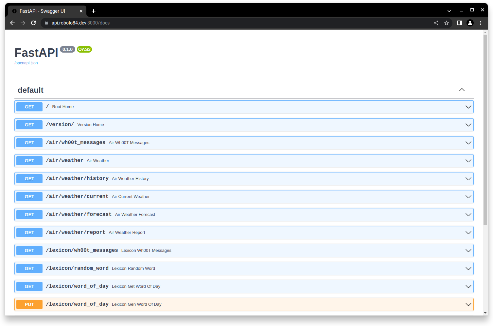

<h1 align="center">roboto_api</h1>

	

## About
`roboto_api` is a REST API for [roboto](https://github.com/roboto84/roboto).

## Usage
To run a local version of `roboto` with all its services, including `roboto_api` go to the [roboto](https://github.com/roboto84/roboto) repo and follow its README.

## Demo

Checkout the [API docs](https://api.roboto84.dev:8000/docs) or the [live demo](https://apps.roboto84.dev):

    
    roboto_api docs

## Commit Conventions
Git commits follow [Conventional Commits](https://www.conventionalcommits.org) message style as explained in detail on their website.

 

    <a href="https://www.flaticon.com/free-icons/robot" title="robot icons">
        roboto_api icon created by Freepik - Flaticon
    </a>

