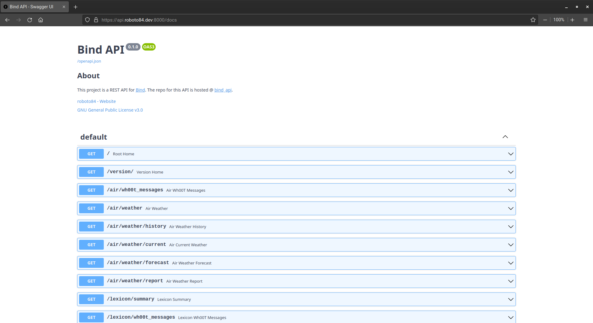

<h1 align="center">bind_api</h1>

	

## About
`bind_api` is a REST API for [Bind](https://github.com/roboto84/bind).

## Usage
To run a local version of `Bind` with all its services, including `bind_api` go to the [Bind](https://github.com/roboto84/bind) repo and follow its README.

## Demo

Checkout the [API docs](https://api.roboto84.dev:8000/docs) or the [live demo](https://bind.roboto84.dev):

    
    bind_api docs

## Commit Conventions
Git commits follow [Conventional Commits](https://www.conventionalcommits.org) message style as explained in detail on their website.

 

    <a href="https://www.flaticon.com/free-icons/flask" target="_blank" title="flask icons">
        bind_api icon created by Freepik - Flaticon
    </a>

